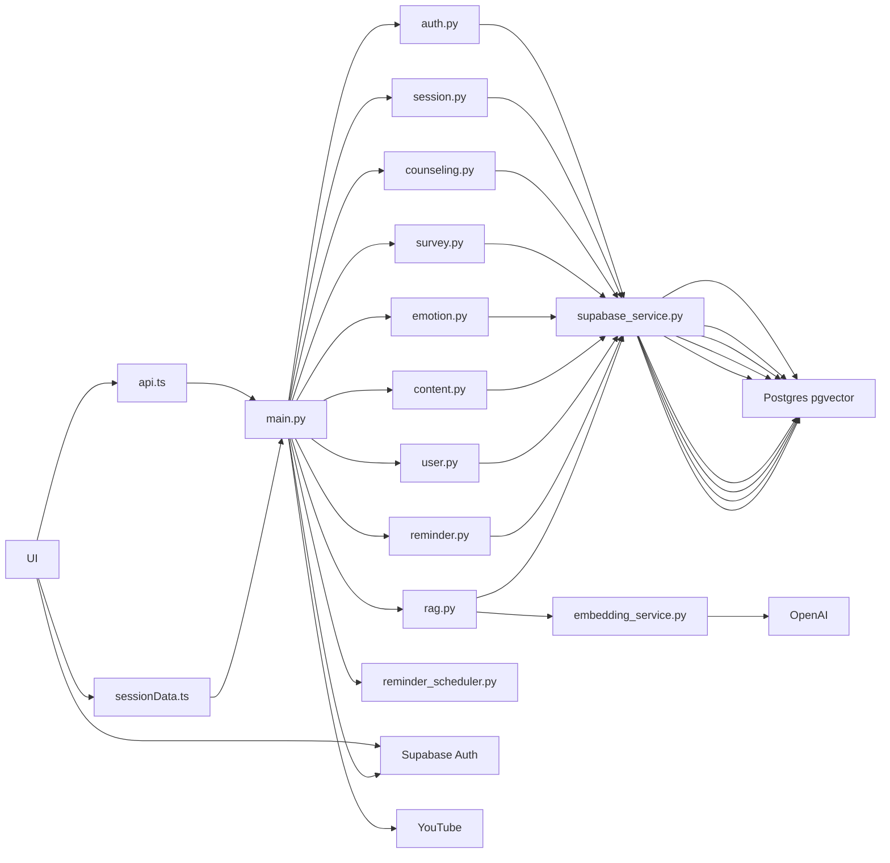
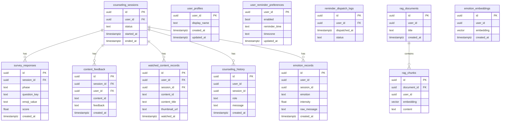

# MoodPick 아키텍처 / 모듈 구조 (Obsidian용)

> **3-에이전트 + MCP 순환 도식**의 개요는 이 문서와 [루트 README](../README.md), [AI 모듈 README](../ai/README.md)를 함께 보세요.

## 1) 시스템 아키텍처(컨테이너/컴포넌트)

## 2) 데이터 모델(핵심 테이블) — 간단 ERD

> 실제 테이블 생성/함수는 `db/migrations/*.sql`에 정의됨.

## 3) 핵심 플로우(요약)

- **문진 점수화 / 변화량(Δ)** (`survey.py`)
  - 이모지 → 점수(`MOOD_EMOJI_MAP`)로 변환 후 저장
  - 같은 세션의 pre/post 점수 차이로 Δ 계산, 평균 Δ로 `improved` 판정

- **감정 요약(평균/추이)** (`emotion.py`)
  - 최근 N일 `survey_responses.score` 평균
  - 최근 3개 vs 이전 3개 평균 비교(±0.5)로 `improving/declining/stable`

- **RAG 검색(유사도)** (`rag.py` + DB 함수)
  - 임베딩(기본 1536차원) 생성/입력 → `match_rag_chunks` RPC
  - 코사인 거리 기반, `similarity = 1 - distance`

- **리마인더** (`reminder.py` + 스케줄러 옵션)
  - 마이페이지에서 사용자 설정 저장
  - 서버 설정에 따라 스케줄러 루프가 켜질 수 있음(`main.py` startup)

## 4) 근거 파일(읽는 순서 추천)

- 라우터 포함: `backend/app/main.py`
- 라우터 구현: `backend/app/routers/*.py`
- DB 스키마/함수: `db/migrations/*.sql`
- 프론트 API 호출: `frontend/lib/api.ts`
- 프론트 세션/문진 헬퍼: `frontend/lib/sessionData.ts`
