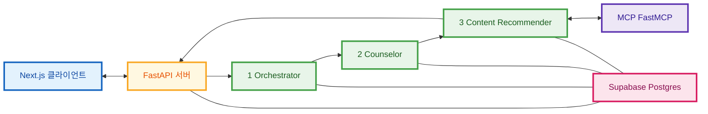

# MoodPick AI 파이프라인 아키텍처

예시 도식과 같은 관점으로 정리했습니다: **클라이언트 ↔ API**, **3-에이전트 순환**, **MCP ↔ 콘텐츠 추천**, **공유 DB**.

---

## 한눈에 보기

| 구분 | 구성 요소 |
|------|-----------|
| UI | Next.js (`frontend/`) |
| API | FastAPI `counseling` 라우터 |
| AI 파이프라인 | Orchestrator → Counselor → Content Recommender (조건부) |
| 외부 도구 | FastMCP (`mcp_servers/`) |
| 데이터 | Supabase Postgres (세션·문진·이력·RAG 등) |

---

## 근거 코드

| 역할 | 위치 |
|------|------|
| 파이프라인 조립 | `ai/pipeline.py` |
| API 진입 | `backend/app/routers/counseling.py` → `backend/app/services/ai_service.py` |
| MCP 호출 | `ai/agents/content_recommender.py` → `mcp_servers/server.py` |
| 상세 설명 | `ai/README.md`, `ai/implementation_plan.md` |

---

## 시각 다이어그램 (Mermaid)

아래는 **모든 노드를 직각 사각형 `[ ]`만 사용**해 네모 박스 형태로 맞춘 버전입니다. (둥근 스타디움·실린더 모양은 사용하지 않음.)  
**메인 다이어그램은 `flowchart LR`(가로)** 로 두어, 클라이언트가 왼쪽에서 시작해 오른쪽으로 이어지도록 했습니다.

**색(`classDef`)** 으로 역할을 구분합니다. 옵시디언에서 색이 무시되면 흑백 직사각형으로만 보입니다.

### 전체 구조 (가로 배치 · 박스형)

클라이언트 → API → 에이전트 순서를 **왼쪽에서 오른쪽(`LR`)** 으로 읽도록 배치했습니다. (예시 그림처럼 옆으로 흐르는 느낌)

### 범례

- 파랑: 사용자가 보는 **클라이언트**
- 노랑: **HTTP 경계** — FastAPI
- 초록: **에이전트** 3단계
- 분홍: **DB** (공유 저장소)
- 보라: **MCP** (YouTube 검색 등 실행 도구)

---

## 예시 도식과의 대응

| 예시 | MoodPick |
|------|----------|
| 클라이언트 | Next.js |
| 서버 | `POST /counseling/message` 등 |
| Orchestrator | `orchestrator_agent` — 위기·의도·추천 필요 초기 판단 |
| Counselor | `counselor_agent` — RAG·공감 응답 등 |
| Content Recommender | `content_recommender_agent` — 쿼리·MCP·추천 구조화 |
| MCP | `mcp_servers/` |
| DB | Supabase |

---

## 동작 시 참고

- **위기 감지** 시 Orchestrator 이후 파이프라인이 **조기 종료**될 수 있음 (`ai/pipeline.py`).
- **콘텐츠 추천**은 `needs_recommendation` 등에 따라 **매 턴마다 실행되지 않을 수** 있음.

---

## 관련 문서

- `docs/ARCHITECTURE.md` — 라우터·서비스 단위 **컴포넌트 전체**
- 본 문서 — 상담 메시지 **AI 파이프라인**만 집중
