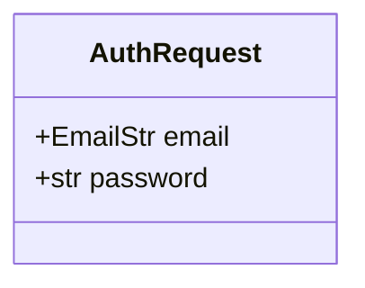
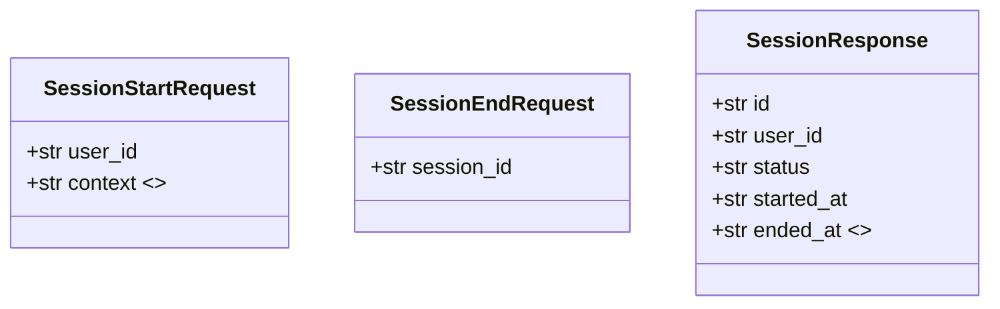
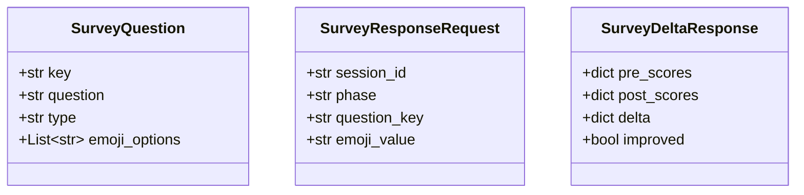
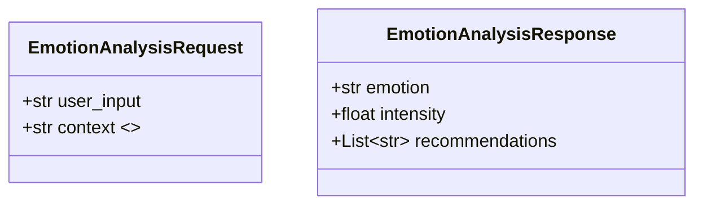
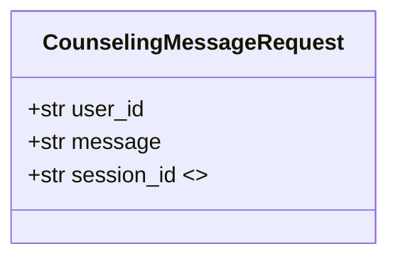
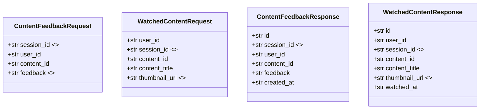
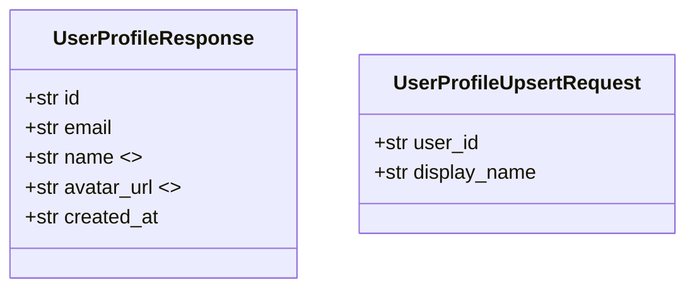
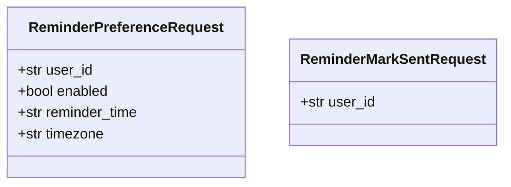
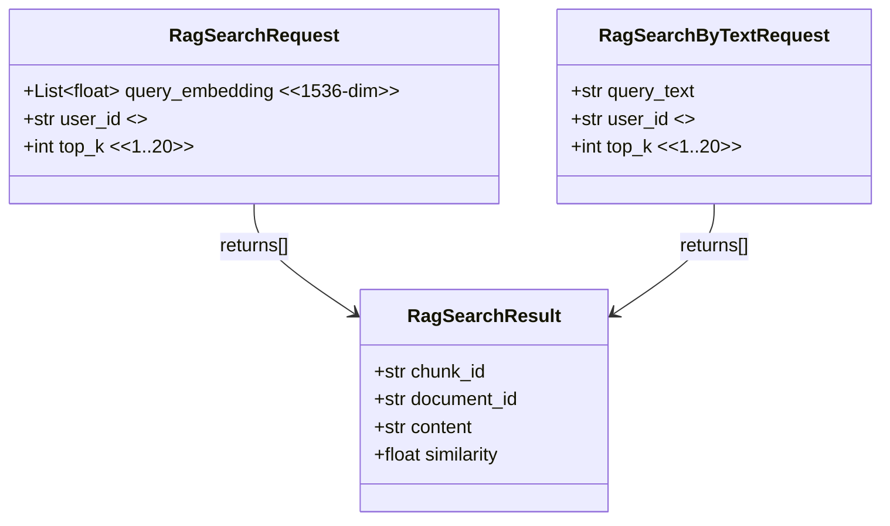

# MoodPick ?대옒??援ъ“)????Pydantic 紐⑤뜽 以묒떖 (Obsidian??

> ???꾨줈?앺듃???꾪넻?곸씤 OOP ?대옒??怨꾩링蹂대떎 **FastAPI ?쇱슦??+ Pydantic(BaseModel) ?붿껌/?묐떟 紐⑤뜽**??以묒떖?낅땲??
> ?곕씪???쒗겢?섏뒪?꾟€앸뒗 **API DTO(?붿껌/?묐떟 ?ㅽ궎留? 援ъ“??*濡??뺣━?⑸땲??

## 1) Auth 紐⑤뜽 (`backend/app/routers/auth.py`)

## 2) Session 紐⑤뜽 (`backend/app/routers/session.py`)

## 3) Survey(臾몄쭊) 紐⑤뜽 (`backend/app/routers/survey.py`)

## 4) Emotion(媛먯젙) 紐⑤뜽 (`backend/app/routers/emotion.py`)

> 媛먯젙 ?쒓린濡??붿빟???묐떟?€ `emotion.py`?먯꽌 `dict` ?뺥깭濡?諛섑솚?섎ʼn, ?꾨줎?몄뿉??蹂꾨룄 ?€?낆쑝濡??ъ슜?⑸땲??

## 5) Counseling(?곷떞) 紐⑤뜽 (`backend/app/routers/counseling.py`)

## 6) Content(肄섑뀗痢? 紐⑤뜽 (`backend/app/routers/content.py`)

## 7) User(?꾨줈?? 紐⑤뜽 (`backend/app/routers/user.py`)

## 8) Reminder 紐⑤뜽 (`backend/app/routers/reminder.py`)

## 9) RAG 紐⑤뜽 (`backend/app/routers/rag.py`)

## 10) 李멸퀬(?쇱슦??援ъ꽦)

?쇱슦?곕뒗 `backend/app/main.py`?먯꽌 ?ㅼ쓬 ?쒖꽌濡?include ?⑸땲??

- `auth`, `session`, `counseling`, `emotion`, `survey`, `content`, `user`, `rag`, `reminder`
