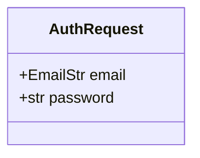
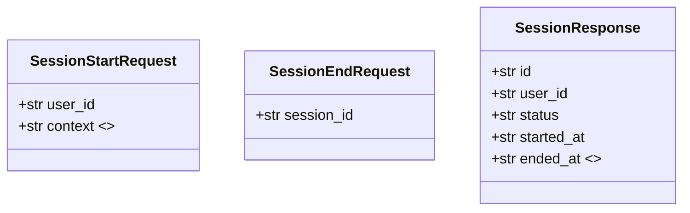
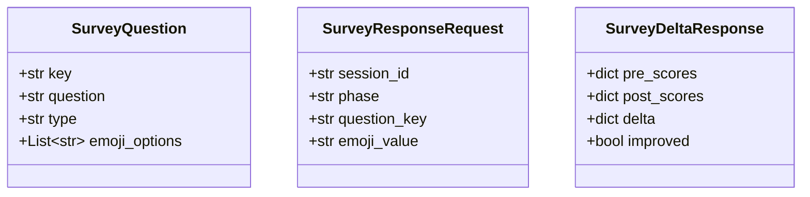
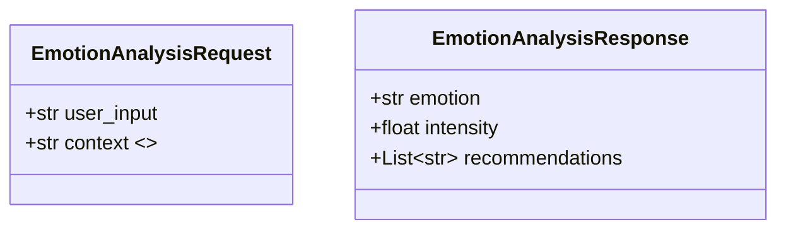
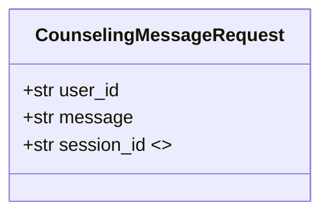
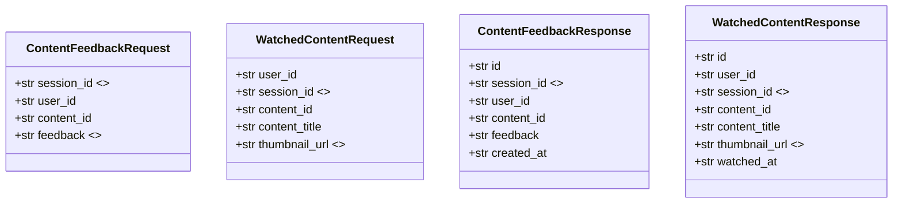
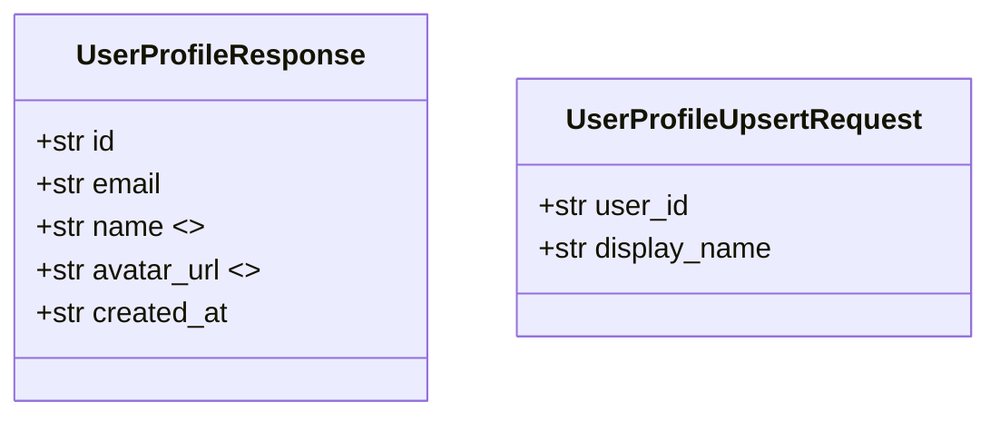
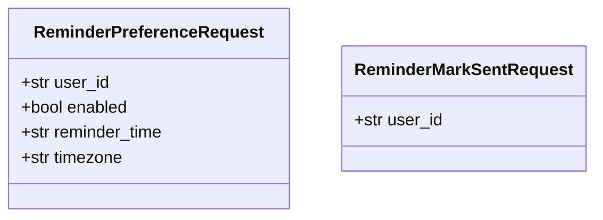
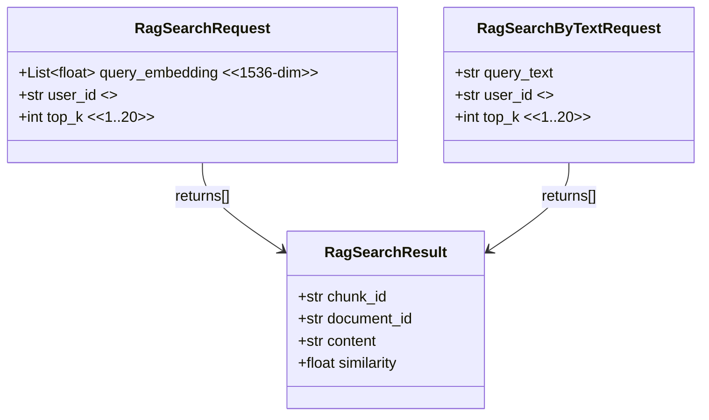

# MoodPick 클래스(구조)도 — Pydantic 모델 중심 (Obsidian용)

> 이 프로젝트는 전통적인 OOP 클래스 계층보다 **FastAPI 라우터 + Pydantic(BaseModel) 요청/응답 모델**이 중심입니다.  
> 따라서 “클래스도”는 **API DTO(요청/응답 스키마) 구조도**로 정리합니다.

## 1) Auth 모델 (`backend/app/routers/auth.py`)

## 2) Session 모델 (`backend/app/routers/session.py`)

## 3) Survey(문진) 모델 (`backend/app/routers/survey.py`)

## 4) Emotion(감정) 모델 (`backend/app/routers/emotion.py`)

> 감정 “기록/요약” 응답은 `emotion.py`에서 `dict` 형태로 반환되며, 프론트에서 별도 타입으로 사용합니다.

## 5) Counseling(상담) 모델 (`backend/app/routers/counseling.py`)

## 6) Content(콘텐츠) 모델 (`backend/app/routers/content.py`)

## 7) User(프로필) 모델 (`backend/app/routers/user.py`)

## 8) Reminder 모델 (`backend/app/routers/reminder.py`)

## 9) RAG 모델 (`backend/app/routers/rag.py`)

## 10) 참고(라우터 구성)

라우터는 `backend/app/main.py`에서 다음 순서로 include 됩니다:

- `auth`, `session`, `counseling`, `emotion`, `survey`, `content`, `user`, `rag`, `reminder`

